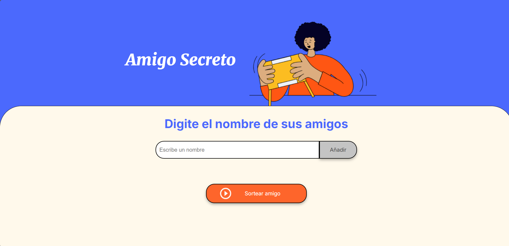

<h1>

"Mi Amigo Secreto"
 </h1>

- [Descripción del Proyecto](#descripcion-proyecto)

- [Estado del proyecto](#Estado-proyecto)

- [Funcionalidades del proyecto](#Funcionalidades-proyecto)

- [Acceso al proyecto](#acceso-proyecto)

- [Tecnologías utilizadas](#tecnologías-utilizadas)

## Descripción del proyecto

Mi amigo secreto es una aplicacion web que permite a los usuarios utilizarla cuand tengan que realizr un sorteo de amigo secreto en sus evento familiares, sociales o academicos. Esta aplicacion permite ingresar una variedad de nombres y tiene la funcionalidad de sortear un nombre aleatorio, siendo este el resultado de tu amigo secreto.

## Estado del proyecto

El proyecto se encuentra finalizado y esta disponible para ser usado por los usuarios.

## Funcionalidades del proyecto

- `Funcionalidad 1`: Ingresar los nombres de tus amigos
- `Funcionalidad 2`: Los nombre son agregados a una lista.
- `Funcionalidad 3`: Dicha lista se mostrara conforme guarde los nombres.
- `Funcionalidad 4`: Se sorteara todos los nombre  aleatoriamente.
- `Funcionalidad 5`: Se Mostrara quien es tu "Amigo Secreto"

## Acceso al proyecto

Puedes acceder a la aplicacion a traves del siguiente enlace:

## TECNOLOGIAS UTILIZADAS

- JavaScript
- HTML
- CSS
